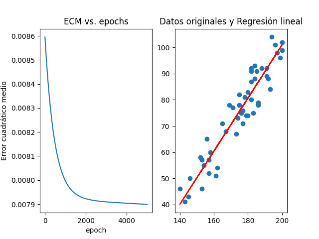
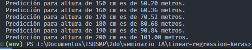

# Práctica de Regresión Lineal con Keras

# Objetivo

Desarrollar un script en Python que implemente un modelo de Regresión Lineal utilizando Keras, basado en un conjunto de datos que incluye altura y peso de personas. El modelo debe permitir encontrar la relación entre la altura y el peso, realizar predicciones y visualizar los resultados.

## Imagen resultado del ejercicio



## Imagen de las predicciones realizadas



- Es menester mencionar que el entrenamiento se realizó con 5000 épocas.

## Como probar el proyecto

1. Instalar dependencias

    ```bash
    pip install -r requirements.txt
    ```

2. Ejecutar

    ```bash
    py main.py
    ```
